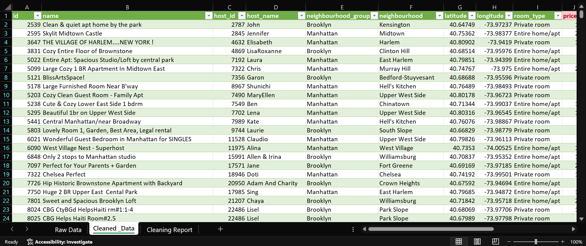

# Data Cleaning and Preprocessing of New York City Airbnb Open Data

## Project Overview

This project focuses on cleaning and preprocessing the New York City Airbnb Open Data dataset using Microsoft Excel. The primary objective was to improve data quality by handling missing values, validating data consistency, formatting data appropriately, and identifying potential outliers. The cleaned dataset is prepared for further analysis and business intelligence applications.

## Dataset Information

**Dataset:** New York City Airbnb Open Data

The dataset contains information about Airbnb listings in New York City, including host details, room types, pricing, reviews, availability, and location-based attributes.

## Tools Used

* Microsoft Excel
* Data Cleaning Techniques
* Conditional Formatting
* Data Validation

## Data Cleaning Process

### 1. Missing Value Handling

* Filled missing values in:

  * `name`
  * `host_name`
  * `reviews_per_month`
  * `last_review`

### 2. Duplicate Record Verification

* Checked the dataset for duplicate records.
* No duplicate entries were found.

### 3. Text Standardization

* Verified and standardized text fields to ensure consistency across categorical columns.

### 4. Date Formatting

* Converted and standardized date values in the `last_review` column.

### 5. Data Type Validation

* Validated numerical, text, and date columns to ensure correct data formats.

### 6. Outlier Detection

* Identified unusually high-priced listings using Excel Conditional Formatting.

## Cleaning Summary

| Cleaning Task           | Status             |
| ----------------------- | ------------------ |
| Missing Values Handling | Completed          |
| Duplicate Removal       | 0 Duplicates Found |
| Text Standardization    | Completed          |
| Date Formatting         | Completed          |
| Data Type Validation    | Completed          |
| Outlier Detection       | Completed          |

## Project Files

* Airbnb Dataset.csv
* Data_Cleaning_Project.xlsx
* Raw Data Screenshot
* Cleaned Data Screenshot
* Cleaning Report Screenshot

## Screenshots

### Raw Dataset

### Cleaned Dataset

### Cleaning Report

## Project Outcome

The dataset was successfully cleaned, validated, and transformed into an analysis-ready format. This process improved data accuracy, consistency, and reliability, making the dataset suitable for future analytical and visualization tasks.

## Internship Project

**Oasis Infobyte Data Analytics Internship**

**Task 3: Data Cleaning**
